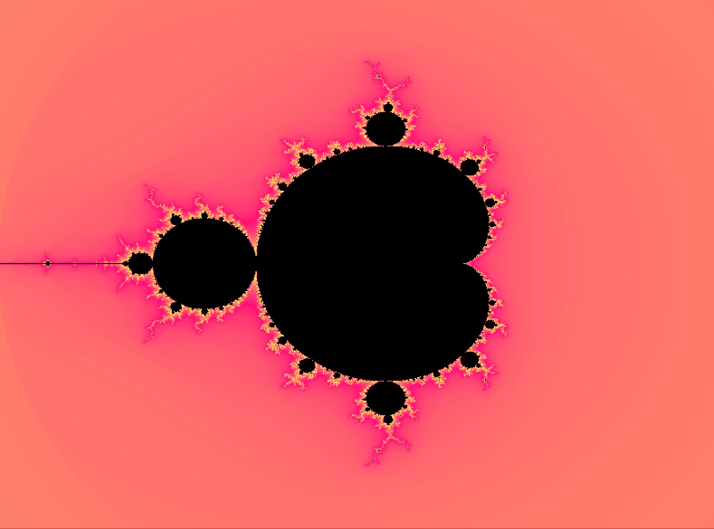

# 🌀 **Fractal Generator**

A simple and interactive fractal renderer written in **C** using the **MLX42** graphics library.  
It supports **Mandelbrot**, **Julia**, and **Burning Ship** fractals with smooth coloring, real-time zooming, panning, and palette cycling.

---

## ⚙️ **Requirements**

- [MLX42](https://github.com/codam-coding-college/MLX42)
- A compiler that supports C99 or later
- macOS (with Metal) or Linux with GLFW & OpenGL installed

---

## 🚀 **Usage**

First, compile the project:

```bash
make
```

Then run one of the following:

### 🟣 **Mandelbrot / Burning Ship**
```bash
./fractal mandelbrot
./fractal burning
```

Optional: provide a palette index (0–4)
```bash
./fractal mandelbrot 2
```

### 🔵 **Julia Set**
Pass two floats as real and imaginary parts between `-2.0` and `2.0`:

```bash
./fractal julia -0.7 0.27015
```

Optional: pass a palette index as a fourth argument:

```bash
./fractal julia -0.7 0.27015 3
```

---

## 🎮 **Controls**

| Key / Input        | Action                                   |
|--------------------|------------------------------------------|
| `← ↑ ↓ →`          | Move/pan the view                        |
| `Mouse Scroll`     | Zoom in/out centered on cursor           |
| `Enter`            | Cycle through color palettes (0–4)       |
| `Space`            | (Julia only) Cycle through preset values |
| `Esc`              | Exit the application                     |

---

## 🎨 **Coloring**

This renderer uses **smooth escape-time gradients** with 5 built-in color palettes.

You can:
- Press `Enter` to cycle through palettes at runtime
- Pass a palette index when launching the program
- Modify or add palettes directly in `init_palette()` (see `color_utils.c`)

---

## 🖼️ **Screenshot**


